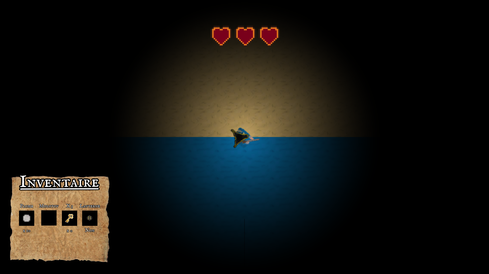
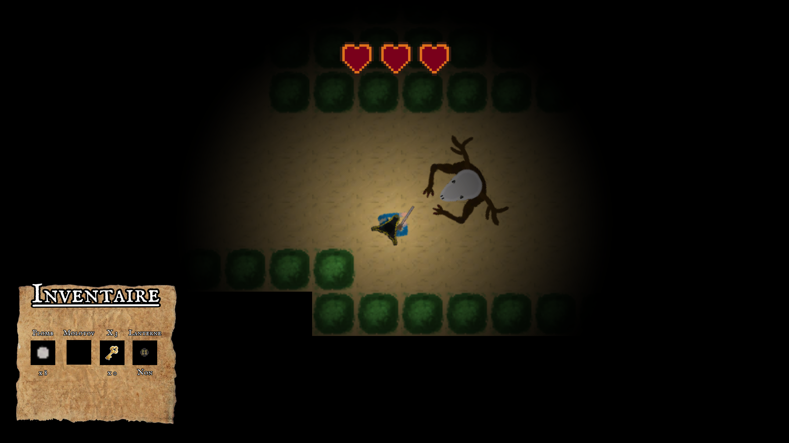

# Intercollégial de Jeu Video Valleyfield 2020 - Jeu Wendigo
## Concept
Il fallait concevoir un jeu vidéo en équipe de 6 sous le thème du folklore québécois. Nous avons décidé d'utiliser Unity et de faire tourner notre jeu alentour du Wendigo. Il y a une caméra top-down, avec ombrage alentour de notre personnage, différents objets à collecter avec des positions aléatoires selon des spawnpoints définis, une sortie bloquée par des clés, et le Wendigo qui nous poursuit.

## Média(s)

### Début

### Personnage

### Wendigo

## Technologies
- Unity
- Git LFS (première fois utilisé)
- Gimp pour le artwork
